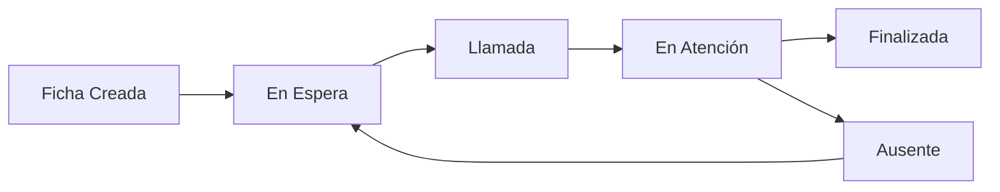

# Sistema de Gestión de Fichas con Integración RRHH

## Descripción General

Backend Laravel para sistema de gestión de fichas que se integra con el sistema RRHH del Ministerio de Relaciones Exteriores de Bolivia. Permite la autenticación dual (local + RRHH), gestión de organizaciones, sucursales, ventanillas y usuarios con validación en tiempo real contra RRHH.

## Características Principales

### 🔐 Autenticación Integrada RRHH
- **Autenticación dual**: Valida credenciales contra RRHH y genera tokens locales
- **Sincronización automática**: Crea usuarios locales basados en datos RRHH
- **Validación organizacional**: Verifica pertenencia del usuario a organizaciones via RRHH
- **Tokens duales**: Retorna tanto token local (Sanctum) como token RRHH

### 👥 Sistema de Roles y Permisos
- **Administrador**: Gestión completa de organizaciones, sucursales, ventanillas y asignaciones
- **Ventanilla**: Solo atención de fichas y operaciones de ventanilla
- **Middleware de autorización**: Protección por roles usando tablas `roles` y `rol_usuario`
- **Validación en tiempo real**: Verificación de permisos en cada request

### 🏢 Gestión Organizacional
- **Organizaciones**: Creación y gestión con validación RRHH
- **Sucursales**: Gestión manual con nombres únicos por organización
- **Ventanillas**: Asignación controlada de usuarios con validación organizacional
- **Validación de integridad**: Solo usuarios de la misma organización pueden ser asignados

### 📋 Gestión de Fichas
- **Flujo completo**: Creación, llamado, atención y finalización
- **Estados controlados**: En espera, llamado, en atención, finalizado, ausente
- **Tipos y prioridades**: Normal, preferencial con diferentes tipos de servicio
- **Seguimiento detallado**: Historial completo de acciones por ficha

## Arquitectura y Optimizaciones

### 1. Integración RRHH
- **Servicios RRHH**: Clases especializadas para comunicación con APIs RRHH
- **Validación dual**: Local + RRHH para máxima seguridad
- **Sincronización de datos**: Nombres de organizaciones obtenidos automáticamente
- **Manejo de errores**: Logs detallados y fallbacks para indisponibilidad RRHH

### 2. Normalización y Relaciones
- **Entidades relacionadas**: Usuarios, ventanillas, sucursales, organizaciones, fichas
- **Claves foráneas**: Todas las relaciones debidamente establecidas
- **Integridad referencial**: Restricciones a nivel de base de datos

### 3. Soft Deletes
- **Recuperación de datos**: Registros eliminados pueden restaurarse
- **Auditoría completa**: Historial de cambios preservado
- **Implementado en**: Ventanillas, sucursales, organizaciones, usuarios

### 4. Validaciones Robustas
- **Request classes**: Validaciones estructuradas y reutilizables
- **Unicidad contextual**: Nombres únicos por organización/sucursal
- **Validación RRHH**: Verificación en tiempo real de datos externos

### 5. Middleware de Seguridad
- **Roles**: Sincronización automática de permisos
- **Token**: Verificación de habilidades específicas por ruta
- **Auth Sanctum**: Protección base de autenticación
## Configuración e Instalación

### Requisitos
- PHP 8.1+
- Laravel 11
- MySQL/SQLite
- Composer

### Variables de Entorno RRHH
```env
RRHH_BASE_URL=https://servicios.rree.gob.bo
RRHH_API_KEY=30a9fbece215a821dbb6a0c531547b7f55602b9a
RRHH_APLICACION=Anfora Virtual
```

### Instalación
```bash
composer install
php artisan migrate
php artisan db:seed
php artisan serve
```

## API Endpoints

### 🔐 Autenticación
```http
POST /api/login
Content-Type: application/json

{
    "usuario": "nombre_usuario_rrhh",
    "password": "contraseña_rrhh"
}
```

**Respuesta exitosa:**
```json
{
    "user": {
        "usuario_id": 1,
        "usuario": "nombre_usuario",
        "nombre_completo": "Nombre Completo",
        "correo_electronico": "usuario@rree.gob.bo"
    },
    "token": "local_sanctum_token",
    "token_rrhh": "external_rrhh_token"
}
```

### 👥 Gestión de Roles
**Nota**: Los roles deben asignarse manualmente en la base de datos tabla `rol_usuario`

- **Administrador**: Acceso completo a gestión organizacional
- **Ventanilla**: Solo atención de fichas

### 🏢 Endpoints Administrativos (Solo Administrador)

#### Organizaciones
```http
GET /api/organizaciones
POST /api/organizaciones
{
    "fk_cod_contacto": 7022
}
```

#### Sucursales
```http
GET /api/sucursales
POST /api/sucursales
{
    "fk_organizacion_id": 1,
    "nombre": "Sucursal Santa Cruz"
}
```

#### Ventanillas
```http
GET /api/ventanillas
POST /api/ventanillas
{
    "fk_sucursal_id": 1,
    "numero": 1
}

POST /api/ventanillas/{ventanilla_id}/asignar-usuario
{
    "usuario_id": 1
}
```

#### Consultas RRHH
```http
GET /api/rrhh/organizaciones
GET /api/rrhh/personas
GET /api/rrhh/organizaciones/{id}/personas
```

### 🎫 Endpoints de Ventanilla (Administrador + Ventanilla)

#### Operaciones de Ventanilla
```http
POST /api/ventanillas/{id}/abrir
POST /api/ventanillas/{id}/cerrar
GET /api/ventanilla/dashboard
```

#### Atención de Fichas
```http
POST /api/ventanilla/rellamar
POST /api/ventanilla/en-atencion
POST /api/ventanilla/finalizar
POST /api/ventanilla/ausente
POST /api/ventanilla/observacion
POST /api/ventanilla/retornar-espera
```

#### Fichas y Llamadas
```http
GET /api/fichas
POST /api/fichas
POST /api/llamadas/llamar-siguiente
```

### 📊 Endpoints Públicos (Sin Autenticación)
```http
GET /api/dominios
GET /api/roles
GET /api/fichas/estadisticas
```

## Manejo de Errores

### Error de Permisos Insuficientes
```json
{
    "error": "No tienes permisos para realizar esta acción",
    "required_roles": ["Administrador"],
    "user_roles": []
}
```

### Error de Validación
```json
{
    "message": "The given data was invalid.",
    "errors": {
        "fk_sucursal_id": ["El campo sucursal es obligatorio."],
        "numero": ["El número ya está en uso en esta sucursal."]
    }
}
```

### Error de Autenticación RRHH
```json
{
    "error": "Credenciales inválidas"
}
```

## Validaciones Especiales

### Asignación Usuario-Ventanilla
- ✅ Usuario debe pertenecer a la misma organización que la ventanilla (validado con RRHH)
- ✅ Una ventanilla solo puede tener un usuario asignado
- ✅ Validación en tiempo real contra servicios RRHH

### Unicidad Contextual
- ✅ Nombres de sucursales únicos por organización
- ✅ Números de ventanilla únicos por sucursal
- ✅ Usuarios únicos por nombre de usuario

## Base de Datos

### Seeders Incluidos
- **Dominios**: Estados, tipos de ficha, tipos de servicio
- **Roles**: Administrador, Ventanilla
- **Usuarios de prueba**: `fichas` y `fichaslapaz` (password: `fichas123`, `fichaslapaz123`)

### Estructura Principal
```
organizaciones (RRHH ID, nombre sincronizado)
├── sucursales (gestión manual)
    ├── ventanillas (numeradas por sucursal)
    ├── usuarios (sincronizados con RRHH)
    └── sesiones (por sucursal/fecha)
        └── fichas (con seguimiento completo)
```

## Seguridad

### Middlewares Implementados
- **`auth:sanctum`**: Autenticación base
- **`roles`**: Sincronización automática de roles
- **`token:RolName`**: Verificación de permisos específicos

### Protección de Rutas
- **Administrativas**: Solo usuarios con rol "Administrador"
- **Operacionales**: Usuarios con rol "Administrador" o "Ventanilla"
- **Públicas**: Sin restricciones

### Logs de Seguridad
- Intentos de acceso no autorizado
- Errores de comunicación con RRHH
- Validaciones fallidas de permisos

## Flujo de Trabajo Típico

### 1. Configuración Inicial (Administrador)
1. **Autenticarse** con credenciales RRHH
2. **Asignar rol Administrador** en BD: `INSERT INTO rol_usuario (fk_usuario_id, fk_rol_id) VALUES (user_id, 1)`
3. **Crear organización** usando ID RRHH (nombre se obtiene automáticamente)
4. **Crear sucursales** para la organización
5. **Crear ventanillas** numeradas por sucursal
6. **Asignar usuarios** a ventanillas (validación automática con RRHH)

### 2. Operación Diaria (Ventanilla)
1. **Autenticarse** con credenciales RRHH
2. **Abrir ventanilla** para comenzar atención
3. **Iniciar sesión** de trabajo
4. **Llamar fichas** y atender usuarios
5. **Cerrar ventanilla** al finalizar jornada

### 3. Gestión de Fichas


## Tecnologías Utilizadas

- **Laravel 11**: Framework PHP
- **Sanctum**: Autenticación por tokens
- **Eloquent ORM**: Manejo de base de datos
- **Guzzle HTTP**: Comunicación con RRHH
- **SQLite/MySQL**: Base de datos
- **Middleware personalizado**: Control de acceso por roles

## Contribución y Desarrollo

### Estructura del Proyecto
```
app/
├── Http/
│   ├── Controllers/Api/     # Controladores de API
│   ├── Middleware/          # Middlewares personalizados
│   └── Requests/           # Validaciones de formularios
├── Models/                 # Modelos Eloquent
└── Services/              # Servicios de negocio
    └── Auth/              # Servicios RRHH
```

### Comandos Útiles
```bash
# Limpiar caché
php artisan cache:clear
php artisan config:clear

# Ver rutas
php artisan route:list

# Ejecutar migraciones
php artisan migrate:fresh --seed

# Ver logs
tail -f storage/logs/laravel.log
```

---
<p align="center"><a href="https://laravel.com" target="_blank"></a></p>

<p align="center">
<a href="https://github.com/laravel/framework/actions"></a>
<a href="https://packagist.org/packages/laravel/framework"></a>
<a href="https://packagist.org/packages/laravel/framework"></a>
<a href="https://packagist.org/packages/laravel/framework"></a>
</p>

## About Laravel

Laravel is a web application framework with expressive, elegant syntax. We believe development must be an enjoyable and creative experience to be truly fulfilling. Laravel takes the pain out of development by easing common tasks used in many web projects, such as:

- [Simple, fast routing engine](https://laravel.com/docs/routing).
- [Powerful dependency injection container](https://laravel.com/docs/container).
- Multiple back-ends for [session](https://laravel.com/docs/session) and [cache](https://laravel.com/docs/cache) storage.
- Expressive, intuitive [database ORM](https://laravel.com/docs/eloquent).
- Database agnostic [schema migrations](https://laravel.com/docs/migrations).
- [Robust background job processing](https://laravel.com/docs/queues).
- [Real-time event broadcasting](https://laravel.com/docs/broadcasting).

Laravel is accessible, powerful, and provides tools required for large, robust applications.

## Learning Laravel

Laravel has the most extensive and thorough [documentation](https://laravel.com/docs) and video tutorial library of all modern web application frameworks, making it a breeze to get started with the framework.

You may also try the [Laravel Bootcamp](https://bootcamp.laravel.com), where you will be guided through building a modern Laravel application from scratch.

If you don't feel like reading, [Laracasts](https://laracasts.com) can help. Laracasts contains thousands of video tutorials on a range of topics including Laravel, modern PHP, unit testing, and JavaScript. Boost your skills by digging into our comprehensive video library.

## Laravel Sponsors

We would like to extend our thanks to the following sponsors for funding Laravel development. If you are interested in becoming a sponsor, please visit the [Laravel Partners program](https://partners.laravel.com).

### Premium Partners

- **[Vehikl](https://vehikl.com)**
- **[Tighten Co.](https://tighten.co)**
- **[Kirschbaum Development Group](https://kirschbaumdevelopment.com)**
- **[64 Robots](https://64robots.com)**
- **[Curotec](https://www.curotec.com/services/technologies/laravel)**
- **[DevSquad](https://devsquad.com/hire-laravel-developers)**
- **[Redberry](https://redberry.international/laravel-development)**
- **[Active Logic](https://activelogic.com)**

## Contributing

Thank you for considering contributing to the Laravel framework! The contribution guide can be found in the [Laravel documentation](https://laravel.com/docs/contributions).

## Code of Conduct

In order to ensure that the Laravel community is welcoming to all, please review and abide by the [Code of Conduct](https://laravel.com/docs/contributions#code-of-conduct).

## Security Vulnerabilities

If you discover a security vulnerability within Laravel, please send an e-mail to Taylor Otwell via [taylor@laravel.com](mailto:taylor@laravel.com). All security vulnerabilities will be promptly addressed.

## License

The Laravel framework is open-sourced software licensed under the [MIT license](https://opensource.org/licenses/MIT).
